# Architecture (current)

One sentence: **a modular monolith**. Everything runs in one Python
process, with clean seams between modules so a future split into
services is a mechanical refactor, not a rewrite.

No microservices today. The only separate process is the mock Workday
service (which exists purely because it IS a different "system" the
agent drives).

---

## Runtime topology — what processes exist

| Process | Port | Why it's separate |
|---|---|---|
| **Andera Python app** | 8000 (FastAPI) | The actual agent. CLI and API share this one process. |
| **Mock Workday** | 8001 (FastAPI) | Pretends to be a tenant Workday. Lets tasks 1 + 5 run locally without a real Workday. |
| **Chromium (Playwright)** | — | Subprocess per browser context, managed by Playwright. Up to `browser.concurrency` of them at once. |
| **Langfuse** (optional) | 3000 | Only runs when you do `docker compose -f docker/compose.yaml up -d`. Off by default. |

Not running: no Redis, no Celery, no separate worker processes, no
external queue broker. The "queue" is a SQLite file with claim-lease
locking; the "workers" are `asyncio` tasks inside the orchestrator.

---

## The full picture

```mermaid
flowchart TB
    subgraph Entry["Entry points (local laptop)"]
        CLI["andera CLI<br/>run · resume · login · verify · check"]
        Dashboard["Web dashboard<br/>localhost:8000 · HTMX + WebSocket"]
        curl["curl / httpie<br/>localhost:8000/api/*"]
    end

    subgraph Proc["Andera Python process (one process, async)"]

        subgraph API["FastAPI app (api/)"]
            Routes["routes/<br/>runs · samples · evidence · events · screencast · connections · plan · ui"]
            EventBus["EventBus (api/ws.py)<br/>in-process pub/sub"]
            Registry["RunRegistry (api/registry.py)<br/>in-memory + disk hydration"]
        end

        subgraph Orchestrator["Orchestrator (orchestrator/runner.py)"]
            RunWorkflow["RunWorkflow<br/>load_inputs → enqueue → fan out"]
            Workers["N async worker tasks<br/>asyncio.gather (browser.concurrency)"]
            SignalHook["SIGTERM handler<br/>graceful drain"]
        end

        subgraph Queue["Queue (queue/sqlite_queue.py)"]
            QDB[("SQLite queue DB<br/>data/&lt;run_id&gt;.queue.db<br/>status: pending|claimed|done|dead")]
            ClaimLease["dequeue: BEGIN IMMEDIATE<br/>+ claim_token"]
        end

        subgraph Agent["Per-sample LangGraph (agent/)"]
            Classify["CLASSIFY<br/>(Haiku)"]
            Plan["PLAN<br/>(Opus + specialist prompt)"]
            PlanCache[("plan_cache/&lt;key&gt;.json<br/>filesystem")]
            Act["ACT<br/>executes one plan step"]
            Observe["OBSERVE<br/>rich snapshot"]
            Verify["VERIFY<br/>(Sonnet)"]
            Extract["EXTRACT<br/>(Haiku, schema-enforced)"]
            Judge["JUDGE<br/>(Opus)"]
            Checkpoint[("LangGraph SqliteSaver<br/>data/&lt;run_id&gt;.ckpt.db<br/>per-sample state")]
        end

        subgraph Browser["Browser tier (browser/)"]
            Pool["BrowserPool<br/>asyncio.Semaphore(N)"]
            Session["LocalPlaywrightSession<br/>one context per sample"]
            RateLimiter["HostRateLimiter<br/>token bucket per hostname"]
            Stealth["stealth.py<br/>navigator patches, UA rotation"]
            SoM["set_of_mark.py<br/>numbered overlay on clickables"]
            Grounding["grounding.py<br/>text + outline + interactive list"]
            Screencast["Screencaster<br/>CDP Page.startScreencast (opt-in)"]
        end

        subgraph Storage["Storage (storage/)"]
            Artifacts[("FilesystemArtifactStore<br/>runs/&lt;run_id&gt;/blobs/&lt;sha[:2]&gt;/&lt;sha&gt;.ext<br/>content-addressed, dedup")]
            Audit[("AuditLog<br/>data/&lt;run_id&gt;.audit.db<br/>hash-chained prev→this")]
            Manifest["RUN_MANIFEST.json<br/>artifacts + audit root + manifest_hash"]
            SamplesJsonl["samples.jsonl<br/>one line per completed sample"]
            RunConfig["&nbsp;.run_config.json<br/>enough to resume"]
        end

        subgraph Models["Models (models/)"]
            Registry2["get_model(role, profile)<br/>lru_cached"]
            LiteLLM["LiteLLMChatModel<br/>num_retries=3, timeout=60s"]
        end

        subgraph Creds["Credentials (credentials/)"]
            Sealed[("data/credentials/&lt;host&gt;.sealed<br/>AES-GCM + HKDF(ANDERA_MASTER_KEY)")]
        end

        subgraph Obs["Observability (observability/)"]
            Trace[("data/traces/&lt;date&gt;.jsonl<br/>always-on")]
            LangfuseCB["litellm.success_callback<br/>= [langfuse] (opt-in)"]
        end

    end

    subgraph External["External (network / subprocess)"]
        Anthropic["api.anthropic.com<br/>Claude Opus / Sonnet / Haiku"]
        Target["Target sites<br/>Linear · GitHub · Workday · LinkedIn · ..."]
        MockWD["Mock Workday<br/>localhost:8001"]
        LangfuseProc["Langfuse<br/>docker, localhost:3000<br/>(optional)"]
        ChromiumProc["Chromium subprocesses<br/>1..N"]
    end

    %% entry point wiring
    CLI --> RunWorkflow
    Dashboard --> Routes
    curl --> Routes
    Routes --> RunWorkflow

    %% orchestrator -> queue -> worker -> agent
    RunWorkflow -->|enqueue all rows| QDB
    RunWorkflow -->|spawn N| Workers
    Workers -->|dequeue + claim| ClaimLease
    ClaimLease --> QDB
    Workers -->|ack / nack / DLQ after 3| QDB
    Workers -->|acquire| Pool
    Pool -->|1 per sample| Session
    Session --> ChromiumProc
    Session --> RateLimiter
    Session --> Stealth
    Session --> SoM
    Session --> Grounding
    Session -. screencast frames .-> EventBus

    %% LangGraph loop
    Workers --> Classify --> Plan --> Act --> Observe --> Verify
    Verify -.consecutive fails.-> Plan
    Verify -->|step_index++| Act
    Verify -->|plan done| Extract --> Judge
    Plan -- hit --> PlanCache
    Plan -- miss --> LiteLLM
    Classify --> LiteLLM
    Verify --> LiteLLM
    Extract --> LiteLLM
    Judge --> LiteLLM
    LiteLLM --> Anthropic
    Act -.tool call.-> Session
    Observe -.snapshot.-> Session

    %% state persistence
    Classify --> Checkpoint
    Plan --> Checkpoint
    Act --> Checkpoint
    Verify --> Checkpoint
    Extract --> Checkpoint
    Judge --> Checkpoint

    %% evidence + audit
    Session -- screenshots --> Artifacts
    Workers -- append --> SamplesJsonl
    Workers -- append --> Audit
    Audit -.publish event.-> EventBus
    RunWorkflow -- finalize --> Manifest
    Manifest -- reads --> Artifacts
    Manifest -- reads --> SamplesJsonl
    Manifest -- reads --> Audit

    %% credentials
    Session -- unseal on demand --> Sealed

    %% observability
    Workers --> Trace
    LiteLLM -.callback.-> LangfuseCB
    LangfuseCB -.optional.-> LangfuseProc

    %% run durability
    RunWorkflow --> RunConfig

    %% browsers navigate the world
    Session --> Target
    Session --> MockWD

    %% dashboard subscribes
    EventBus -.WebSocket.-> Dashboard

    classDef store fill:#1a202c,stroke:#4a5568,color:#fff
    classDef external fill:#2c5282,stroke:#2a4365,color:#fff
    classDef llm fill:#744210,stroke:#5c3317,color:#fff
    class QDB,PlanCache,Checkpoint,Artifacts,Audit,SamplesJsonl,RunConfig,Sealed,Trace store
    class Anthropic,Target,MockWD,LangfuseProc,ChromiumProc external
    class LiteLLM,Classify,Plan,Verify,Extract,Judge llm
```



---

## Where everything lives on disk

```
andera/
├── data/                          # runtime, gitignored
│   ├── state.db                   # seed DB (schema only)
│   ├── <run_id>.queue.db          # per-run queue (SQLite WAL)
│   ├── <run_id>.audit.db          # per-run hash-chained audit log
│   ├── <run_id>.ckpt.db           # LangGraph SqliteSaver checkpoints
│   ├── plan_cache/<sha>.json      # cached plans keyed on task+schema+url pattern
│   ├── traces/<YYYY-MM-DD>.jsonl  # always-on JSONL trace
│   └── credentials/<host>.sealed  # AES-GCM sealed Playwright storage_state
│
├── runs/<run_id>/                 # evidence output, gitignored
│   ├── blobs/<sha[:2]>/<sha>.png  # content-addressed screenshots
│   ├── samples.jsonl              # per-sample durable record
│   ├── output.csv                 # aggregate (built from samples.jsonl)
│   ├── RUN_MANIFEST.json          # artifact hashes + audit root + manifest hash
│   └── .run_config.json           # task + run metadata for resume
│
└── services/mock_workday/
    ├── employees.json             # 100 seeded employees
    └── attachments/               # confirmation files the form flow writes
```

---

## What's actually concurrent

At run time, with `browser.concurrency = 10`:

- **1** asyncio event loop in the main Python process
- **10** async worker coroutines dequeuing from the SQLite queue
- **10** Playwright browser contexts (each its own Chromium subprocess thread pool, but effectively one tab each)
- **~50** in-flight HTTP requests to Anthropic at steady state (each sample runs ~5 LLM calls: classify, plan, verify×N, extract, judge; reduced to ~3 after the plan cache warms)
- **1** EventBus publisher, N WebSocket subscribers
- **1** append-only writer per SQLite database (protected by `asyncio.Lock`)

Per-host throttling kicks in via `HostRateLimiter`: default 2 rps + burst 4 per target hostname. LinkedIn task YAML overrides to 0.5 rps + concurrency 1.

---

## What's sequential / serialized

- **Plan cache writes**: atomic via tmp+rename, but effectively serialized because the first sample warms the cache and the rest read.
- **SQLite queue writes** (enqueue, dequeue-claim, ack/nack): serialized through an `asyncio.Lock` within the process + SQLite's own file locking for cross-process.
- **Audit log writes**: `BEGIN IMMEDIATE` transaction around prev_hash read + insert, so the chain never races.
- **Samples.jsonl writes**: serialized through `asyncio.Lock` within `_record_result`.

---

## What happens on failure (today)

- **LLM 429 / transient timeout**: LiteLLM retries up to 3× with backoff.
- **Target site 429**: currently no explicit backoff — the per-host rate limiter throttles preemptively. A real 429 response is not yet parsed to adjust the limiter dynamically.
- **Browser tool throws**: wrapped in `ToolResult{status: "error"}`; the LangGraph verifier sees a failed step, reflects, eventually fails the sample.
- **Sample fails**: nacked on the queue; retried up to 3× total; then DLQ (status `dead`).
- **Worker exception**: caught at `_worker`, the item is nacked with the traceback.
- **Process crashes**: samples marked `claimed` are orphaned until `reclaim_stale(older_than_seconds=0)` runs (which `andera resume` does on boot).
- **SIGTERM**: workers check an `asyncio.Event` between samples; they drain in-flight work, then exit. Resume picks up from `samples.jsonl` + queue state.

---

## What this means for the architectural changes you're considering

### "Split scraping into its own worker" (Celery / RQ / Arq / etc.)

Today the "worker" is `_worker()` — an async coroutine in the same process. To split it out:

- `TaskQueue` Protocol already exists and has `enqueue/dequeue/ack/nack/dead_letter`. Swap `SqliteQueue` → `RedisQueue` (or `NatsQueue`) by writing one ~80-line class that implements the same Protocol. **No orchestrator change.**
- `RunWorkflow._worker` moves out to a separate entry point that imports the same `AgentDeps` builder and the same LangGraph. It listens on the same queue.
- The main process becomes a coordinator that only enqueues + watches counters. Workers can scale horizontally.

**Blocker we'd have to solve**: the current `PlanCache` is a shared filesystem directory — fine on one host, not across containers. Either move plan cache to Redis or use a shared volume. For 10+ containers, Redis is cleaner.

### "Different queues — retry queue, DLQ, link-discovery queue"

Today: one queue per run, with `status` column doubling as the DLQ (`status='dead'`). Expanding to multiple queues:

- **Retry queue with delayed visibility**: SQLite can do this with a `visible_at` timestamp column + `WHERE visible_at <= now()`. Or: Redis sorted set with score = visible_at_epoch. Or: SQS / Celery have this built-in.
- **DLQ as a separate queue**: trivial — another SqliteQueue / RedisQueue instance with a different name. Orchestrator routes there on terminal failure.
- **Link-discovery queue**: this is the interesting one. It implies the agent **produces** new URLs during a run (e.g., scraping a commit page also yields PR + CI + Jira URLs worth scraping). Today task 3 handles this in one sample — the plan navigates to all of them. Splitting it into a separate queue would let sub-URLs run as independent samples with their own evidence, and is cleaner for deduplication + retry. **Architecturally a good move for deep-crawl tasks.** Implementation: the `Act` node would gain the ability to emit `new_jobs: [...]` into state, and the orchestrator would enqueue them before nack/ack.

### "Redis for rate limiting"

Today: `HostRateLimiter` is in-process. With 1 worker = 1 limiter, so 5 worker containers would each independently allow `per_host_rps` requests/sec — so 5× what you configured. Moving the limiter to Redis (`INCR` + `EXPIRE`) gives you a global budget.

Cheap fix if you do split into containers: **Redis INCR-based token bucket** or a library like `redis-cell`. ~50 lines. Plugs into the same `HostRateLimiter` interface.

### "Separate HTML / metadata store (S3 + Postgres)"

Today: screenshots + HTML are content-addressed on local filesystem; metadata is in SQLite. `ArtifactStore` Protocol already fits an S3 swap — write `S3ArtifactStore(ArtifactStore)` that implements the same `put/get/local_path`. For metadata, the SQLite schema translates directly to Postgres (no SQLite-specific SQL).

The more interesting split: **separate the "scraped raw content" from "extracted structured data."** Today both are blob-on-disk + row-in-SQLite. If you keep raw HTML per page in S3 (for replay + audit), and extracted fields in Postgres (for query), you get:
- cheap cold storage for audit (S3)
- queryable hot store for dashboards (Postgres)
- ability to re-extract from old raw HTML if the extractor prompt changes

This is the pattern real scraping infra uses. Not needed at 1000 samples; matters at 10M.

### "Local ports vs Docker"

For the 4-5 services you'd split into (coordinator, scraper workers, Redis, Postgres, Langfuse), **Docker is fine on any modern laptop**. Apple Silicon handles 6 containers without breaking a sweat. Intel Macs too.

**The only reason to run on different local ports instead**: fast inner-loop development. When you're iterating on the scraper worker code, `uv run python -m andera.worker` is faster than `docker compose up worker` + rebuild cycle. The good path: develop with local ports, integration-test with docker compose.

My rule of thumb:
- **Dev inner loop**: local ports, one `uv run` per service.
- **CI / integration**: docker compose.
- **Demo day**: whichever is more reliable on the morning. If the network is flaky, one `uv run andera run ...` is the most robust demo — no containers, just a Python process + Chromium.

---

## The honest scorecard on what's "production-ready"

| Concern | Today | For 10k/day | For 10M/day |
|---|---|---|---|
| Queue | SQLite WAL | Redis / SQS | Kafka / NATS |
| Rate limit | In-process bucket | Redis INCR | Redis + dedicated rate-limit service |
| Worker scale | 1 process × N asyncio | N containers × M asyncio | K8s HPA on custom metrics |
| Artifact store | Filesystem | S3 | S3 + CDN |
| Metadata | SQLite | Postgres | Postgres + read replicas |
| Observability | JSONL + Langfuse | Langfuse | Langfuse + OTEL + Prom + Grafana |
| Retries | Queue-level + LLM-level | + exponential backoff + circuit breaker | + bulkheads per-target-host |
| DLQ | `status='dead'` row | Separate dead queue + alerts | DLQ with re-drive tooling |

The work-trial scope is "single laptop, 1000 samples, demo-grade." Everything under "Today" is appropriate for that scope. The right-hand columns are where the current Protocols let you go without rewriting.
